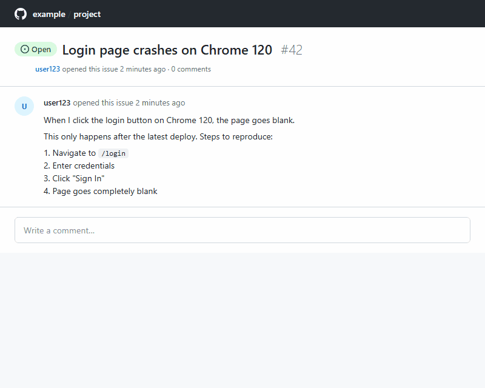

<div align="center">

# ⚡ Issue AI Agent

**AI-powered Forgejo Issue triage — classify, label, and reply automatically**

[](https://github.com/andrewthetechie/issue-ai-agent/actions)
[](LICENSE)

</div>

## What It Does

When someone opens an issue in your repository, Issue AI Agent:

1. **Classifies** the issue into a category (bug, feature, question, docs, duplicate, invalid, security)
2. **Labels** it with matching labels and a priority level (critical, high, medium, low)
3. **Detects duplicates** by searching existing issues and linking potential matches
4. **Replies** with a contextual comment — bugs get asked for reproduction steps, features get acknowledged, etc.
5. **Handles follow-up comments** — replies to user comments with relevant information

Powered by your LLM of choice.

## Demo



1. **User opens an issue** — describes a login page crash
2. **Bot classifies** — labels it `bug` / `priority: high` in ~8 seconds
3. **Bot replies** — asks for reproduction details
4. **Duplicate check** — searches existing issues and links potential matches
5. **Follow-up comments** — replies to user comments with relevant info

## Quick Start

### Step 1: Add a workflow file

Create `.forgejo/workflows/issue-ai.yml` in your repository:

```yaml
name: Issue AI Agent

on:
  issues:
    types: [opened]
  issue_comment:
    types: [created]

jobs:
  triage:
    runs-on: ubuntu-latest
    permissions:
      issues: write
      contents: read
    steps:
      - uses: andrewthetechie/issue-ai-agent@v1
        with:
          anthropic-api-key: ${{ secrets.ANTHROPIC_API_KEY }}
```

### Step 2: Add your API key

Go to **Settings > Secrets and variables > Actions > New repository secret**:

- Name: `ANTHROPIC_API_KEY`
- Value: your Anthropic API key (get one at [console.anthropic.com](https://console.anthropic.com))

### Step 3: Open an issue

That's it. The bot will automatically classify, label, and reply to new issues.

## LLM Providers

The bot supports any Anthropic or OpenAI API. Use the three inputs — `<provider>-api-key`, `llm-provider`, and `llm-base-url` — to match your setup.

### Anthropic

```yaml
- uses: andrewthetechie/issue-ai-agent@v1
  with:
    anthropic-api-key: ${{ secrets.ANTHROPIC_API_KEY }}
    llm-provider: anthropic
```

### OpenAI

```yaml
- uses: andrewthetechie/issue-ai-agent@v1
  with:
    openai-api-key: ${{ secrets.OPENAI_API_KEY }}
    llm-provider: openai
```

### Custom API endpoint

If your provider exposes an Anthropic or OpenAI compatible API, point `llm-base-url` to its address:

```yaml
# Anthropic-compatible endpoint
- uses: andrewthetechie/issue-ai-agent@v1
  with:
    anthropic-api-key: ${{ secrets.LLM_API_KEY }}
    llm-provider: anthropic
    llm-base-url: https://your-provider.example.com/api/anthropic
```

```yaml
# OpenAI-compatible endpoint
- uses: andrewthetechie/issue-ai-agent@v1
  with:
    openai-api-key: ${{ secrets.LLM_API_KEY }}
    llm-provider: openai
    llm-base-url: https://your-provider.example.com/v1
```

If you use a custom model, create `.github/issue-ai.yml` in your repo to specify it:

```yaml
llm:
  model: your-model-name
```

## Configuration

Create `.github/issue-ai.yml` in your repository to customize behavior. The bot works out of the box with sensible defaults — no config file required.

```yaml
# .github/issue-ai.yml
enabled: true

features:
  classify: true        # Auto-classify issues
  reply: true           # Post AI-drafted replies
  duplicateSearch: true  # Detect duplicate issues
  commentReply: true     # Reply to follow-up comments

label_mapping:
  bug: ["bug"]
  feature: ["enhancement"]
  question: ["question"]
  docs: ["documentation"]
  duplicate: ["duplicate"]
  invalid: ["invalid"]
  security: ["security"]

security:
  max_issue_length: 10000    # Max chars of issue body to process

exclude:
  labels: ["wontfix", "skip-ai"]       # Skip issues with these labels
  users: ["dependabot[bot]"]           # Skip issues from these users

llm:
  provider: anthropic                   # "anthropic" or "openai"
  model: claude-haiku-4-5-20251001     # Model to use
  max_tokens: 2048                      # Max tokens per LLM response
```

### Config Reference

| Key | Default | Description |
|-----|---------|-------------|
| `enabled` | `true` | Master on/off switch |
| `features.classify` | `true` | Enable issue classification + labeling |
| `features.reply` | `true` | Enable AI-drafted reply comments |
| `features.duplicateSearch` | `true` | Search for duplicate issues and link them |
| `features.commentReply` | `true` | Reply to follow-up comments on issues |
| `label_mapping` | *(see defaults above)* | Maps AI categories to your repo's label names |
| `security.max_issue_length` | `10000` | Truncate issue body beyond this length |
| `exclude.labels` | `["wontfix", "skip-ai"]` | Skip issues carrying these labels |
| `exclude.users` | `["dependabot[bot]"]` | Skip issues opened by these users |
| `llm.provider` | `"anthropic"` | LLM provider: `"anthropic"` or `"openai"` |
| `llm.model` | `claude-haiku-4-5-20251001` | Model identifier |
| `llm.max_tokens` | `2048` | Max tokens for LLM responses |

## Action Inputs & Outputs

### Inputs

| Input | Required | Default | Description |
|-------|----------|---------|-------------|
| `github-token` | No | `${{ github.token }}` | GitHub token for API access |
| `anthropic-api-key` | No | | Anthropic API key |
| `openai-api-key` | No | | OpenAI API key |
| `llm-provider` | No | `anthropic` | Which LLM provider to use |
| `llm-base-url` | No | | Custom base URL for LLM API (applies to selected provider) |
| `config-path` | No | `.github/issue-ai.yml` | Path to config file in repo |

At least one API key is required. If neither is set, the bot runs in **dev mode** with mock responses.

### Outputs

| Output | Description |
|--------|-------------|
| `category` | Classified issue category |
| `priority` | Classified issue priority |
| `labels-applied` | Comma-separated list of applied labels |
| `reply-posted` | Whether a reply comment was posted |

## Development

```bash
npm ci              # Install dependencies
npm run build       # Compile TypeScript
npm run bundle      # Bundle for GitHub Action (dist/index.js)
npm test            # Run tests (Vitest)
npm run test:watch  # Watch mode
npm run dev         # TypeScript watch mode
```

### Architecture

```
GitHub Action (issues.opened / issue_comment.created)
  → loadConfig()    — Fetch .github/issue-ai.yml via GitHub API
  → shouldExclude() — Check exclude rules
  → classify        — LLM classifies the issue (category + priority)
  → label           — Maps classification to repo labels via GitHub API
  → duplicate       — Searches similar issues, LLM confirms duplicates
  → reply           — Drafts and posts a contextual comment via LLM
```

Key design decisions:
- **Stateless** — no database; reads config from each repo's `.github/issue-ai.yml`
- **Error-resilient** — each pipeline step catches its own errors, so a classification failure doesn't block the reply
- **Security-first** — input sanitization (zero-width chars, control chars, length limits) + explicit untrusted-data markers in prompts

## License

[MIT](LICENSE)
